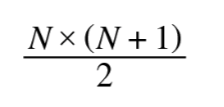
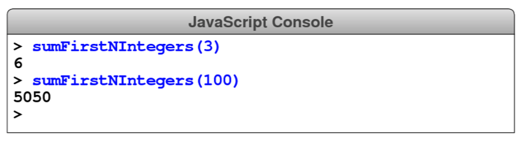

# CHALLENGE 3

According to mathematical historians, the German mathematician Carl Friedrich Gauss (1777–1855) began to show his mathematical talent at a very early age. When he was in primary school, Gauss was asked by his teacher to compute the sum of the first 100 integers. Gauss is said to have produced the answer instantly by working out that the sum of the first N integers is given by the formula:

Write a function `sumFirstNIntegers` that takes the value of N as its argument and returns the sum of those integers, as illustrated in the following sample run:

